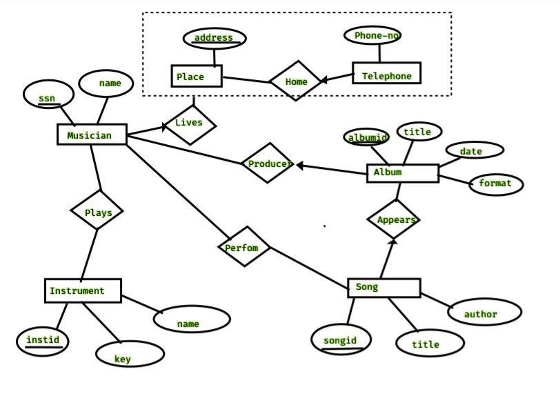

\newpage

# Demonstrate an example of ER-Diagram and its relational database schema


<!--[The voyage to the moon](#fig:lalune).-->


## Example for ER-diagram

A record company `XYZ` has decided to store information about musicians who perform on all its albums(as well as other company data) in a database. Following are the conditions/constraints:

* Each musician that records at `XYZ` has an _ssn_, a _name_, an _address_, and a _phone number_.
* Each instrument used ins the songs recoreded at `XYZ` has a unique _identification_ number, a _name_(e.g., guitar, flute etc.) and a _musical key_.
* Each albumn recorded on the `XYZ` label has a unique _identification number_, a _title_, a _copyright date_, a _format_ and an _album identifier_.
* Each song recoreded at `XYZ` has a _title_ and an _author_.
* Each musician may play several instruments and a given instrument may be played by several musicians.
* Each album has a number of songs on it, but no song may appear on more than one album.
* Each song is performed by one or more musicians, and a musician my perform a number of songs.
* Each album has exactly one musician who acts as its producer. A musician can produce several albums.


Considering above conditions/constraints we'll obtain a _ER-Diagram_ which will look something like this:

<div id="fig:er-diagram">


</div>

\newpage

Now, let's convert the above _ER-Diagram_ to _Relational Database_. I'll perform this operation on `mysql`.

## Relation Database schema

Creation of _relational database schema_ for the above _er-diagram_.

```sql
-- creation of Musician
MariaDB [csb]> create table Musician(ssn varchar(10), name varchar(30),
 primary key(ssn));
Query OK, 0 rows affected (0.175 sec)

MariaDB [csb]> desc Musician;
+-------+-------------+------+-----+---------+-------+
| Field | Type        | Null | Key | Default | Extra |
+-------+-------------+------+-----+---------+-------+
| ssn   | varchar(10) | NO   | PRI | NULL    |       |
| name  | varchar(30) | YES  |     | NULL    |       |
+-------+-------------+------+-----+---------+-------+
2 rows in set (0.002 sec)

-- creation of Insturment
-- note: changed name of attriubute key to instkey
MariaDB [csb]> create table Instrument(instid varchar(10) primary key,
name varchar(30), instkey varchar(5));
Query OK, 0 rows affected (0.122 sec)

MariaDB [csb]> desc Instrument;
+---------+-------------+------+-----+---------+-------+
| Field   | Type        | Null | Key | Default | Extra |
+---------+-------------+------+-----+---------+-------+
| instid  | varchar(10) | NO   | PRI | NULL    |       |
| name    | varchar(30) | YES  |     | NULL    |       |
| instkey | varchar(5)  | YES  |     | NULL    |       |
+---------+-------------+------+-----+---------+-------+
3 rows in set (0.002 sec)

-- creating Plays relation
MariaDB [csb]> create table Plays
	-> (ssn varchar(10), instid varchar(10),
	-> primary key(ssn, instid),
	-> foreign key(ssn) references Musician(ssn),
	-> foreign key(instid) references Instrument(instid));
Query OK, 0 rows affected (0.180 sec)

MariaDB [csb]> desc Plays;
+--------+-------------+------+-----+---------+-------+
| Field  | Type        | Null | Key | Default | Extra |
+--------+-------------+------+-----+---------+-------+
| ssn    | varchar(10) | NO   | PRI | NULL    |       |
| instid | varchar(10) | NO   | PRI | NULL    |       |
+--------+-------------+------+-----+---------+-------+
2 rows in set (0.002 sec)

-- song 'Appears' relation
MariaDB [csb]> create table Song(
	-> songid int primary key, title varchar(30), author varchar(20));
Query OK, 0 rows affected (0.124 sec)

-- create Song table;
MariaDB [csb]> desc Song;
+--------+-------------+------+-----+---------+-------+
| Field  | Type        | Null | Key | Default | Extra |
+--------+-------------+------+-----+---------+-------+
| songid | int(11)     | NO   | PRI | NULL    |       |
| title  | varchar(30) | YES  |     | NULL    |       |
| author | varchar(20) | YES  |     | NULL    |       |
+--------+-------------+------+-----+---------+-------+
3 rows in set (0.002 sec)

-- create Perform relation
MariaDB [csb]> create table Perform
	-> (ssn varchar(10), songid int, performdate date,
	-> primary key(ssn, songid),
	-> foreign key(ssn) references Musician(ssn),
	-> foreign key(songid) references Song(songid));
Query OK, 0 rows affected (0.145 sec)

MariaDB [csb]> desc Perform;
+-------------+-------------+------+-----+---------+-------+
| Field       | Type        | Null | Key | Default | Extra |
+-------------+-------------+------+-----+---------+-------+
| ssn         | varchar(10) | NO   | PRI | NULL    |       |
| songid      | int(11)     | NO   | PRI | NULL    |       |
| performdate | date        | YES  |     | NULL    |       |
+-------------+-------------+------+-----+---------+-------+
3 rows in set (0.002 sec)

-- create Album table
MariaDB [csb]> create table Album
	-> (albumid varchar(10), title varchar(30),
	-> releasedate date, format varchar(12), primary key(albumid));
Query OK, 0 rows affected (0.125 sec)

MariaDB [csb]> desc Album;
+-------------+-------------+------+-----+---------+-------+
| Field       | Type        | Null | Key | Default | Extra |
+-------------+-------------+------+-----+---------+-------+
| albumid     | varchar(10) | NO   | PRI | NULL    |       |
| title       | varchar(30) | YES  |     | NULL    |       |
| releasedate | date        | YES  |     | NULL    |       |
| format      | varchar(12) | YES  |     | NULL    |       |
+-------------+-------------+------+-----+---------+-------+
4 rows in set (0.001 sec)

-- create Appears relation
MariaDB [csb]> create table Appears
	-> (albumid varchar(10), songid int, so ngnumberinalbum int,
	-> primary key(albumid, songid),
	-> foreign key(albumid) references Album(albumid),
	-> foreign key(songid) references Song(songid));
Query OK, 0 rows affected (0.140 sec)

MariaDB [csb]> desc Appears;
+-------------------+-------------+------+-----+---------+-------+
| Field             | Type        | Null | Key | Default | Extra |
+-------------------+-------------+------+-----+---------+-------+
| albumid           | varchar(10) | NO   | PRI | NULL    |       |
| songid            | int(11)     | NO   | PRI | NULL    |       |
| songnumberinalbum | int(11)     | YES  |     | NULL    |       |
+-------------------+-------------+------+-----+---------+-------+
3 rows in set (0.002 sec)

-- create 'Producer' relation
MariaDB [csb]> create table Producer (ssn varchar(10), albumid varchar(10), productionstarted date, primary key(ssn, albumid), foreign key(ssn
) references Musician(ssn), foreign key(albumid) references Album(album
id));
Query OK, 0 rows affected (0.274 sec)

MariaDB [csb]> desc Producer;
+-------------------+-------------+------+-----+---------+-------+
| Field             | Type        | Null | Key | Default | Extra |
+-------------------+-------------+------+-----+---------+-------+
| ssn               | varchar(10) | NO   | PRI | NULL    |       |
| albumid           | varchar(10) | NO   | PRI | NULL    |       |
| productionstarted | date        | YES  |     | NULL    |       |
+-------------------+-------------+------+-----+---------+-------+
3 rows in set (0.002 sec)

-- Place table
MariaDB [csb]> create table Place(address varchar(30) primary key);
Query OK, 0 rows affected (0.150 sec)

MariaDB [csb]> desc Place;
+---------+-------------+------+-----+---------+-------+
| Field   | Type        | Null | Key | Default | Extra |
+---------+-------------+------+-----+---------+-------+
| address | varchar(30) | NO   | PRI | NULL    |       |
+---------+-------------+------+-----+---------+-------+
1 row in set (0.002 sec)

-- Telephone table
MariaDB [csb]> create table Telephone(phoner_no int primary key);
Query OK, 0 rows affected (0.122 sec)

MariaDB [csb]> desc Telephone;
+-----------+---------+------+-----+---------+-------+
| Field     | Type    | Null | Key | Default | Extra |
+-----------+---------+------+-----+---------+-------+
| phoner_no | int(11) | NO   | PRI | NULL    |       |
+-----------+---------+------+-----+---------+-------+
1 row in set (0.002 sec)

-- Home relation
MariaDB [csb]> create table Home
    -> (phone_no int, address varchar(30),
    -> primary key(phone_no),
    -> foreign key(address) references Place(address));
Query OK, 0 rows affected (0.189 sec)

MariaDB [csb]> desc Home;
+----------+-------------+------+-----+---------+-------+
| Field    | Type        | Null | Key | Default | Extra |
+----------+-------------+------+-----+---------+-------+
| phone_no | int(11)     | NO   | PRI | NULL    |       |
| address  | varchar(30) | YES  | MUL | NULL    |       |
+----------+-------------+------+-----+---------+-------+
2 rows in set (0.002 sec)

-- relation Lives
MariaDB [csb]> create table Lives
	-> (ssn varchar(10), phone_no int,
	-> foreign key(phone_no) references Home(phone_no));
Query OK, 0 rows affected (0.147 sec)

MariaDB [csb]> desc Lives;
+----------+-------------+------+-----+---------+-------+
| Field    | Type        | Null | Key | Default | Extra |
+----------+-------------+------+-----+---------+-------+
| ssn      | varchar(10) | YES  |     | NULL    |       |
| phone_no | int(11)     | YES  | MUL | NULL    |       |
+----------+-------------+------+-----+---------+-------+
2 rows in set (0.002 sec)
```

### Tools used in creating this practical(pdf)

* **OS                     :** 5.4.85-1-MANJARO
* **WM**                   : [DWM](https://dwm.suckless.org)
* **Pdf(markup) convertor**: Pandoc(2.11.2)
* **Pdf engine             :** xelatex
* **Source File Format     :** Markdown(md)
* **Text Editor            :** Neovim-nightly(v0.5.0-dev+1000-g84d08358b)
* **DB used:** Mariadb(Ver 15.1 Distrib 10.5.8-MariaDB)

---
									*-*-* THE END *-*-*
---
