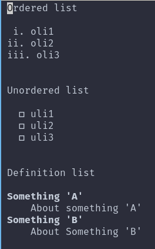

\newpage

# HTML Programs

## Program for creating list

Example demonstrating `HTML` program for creating list

### Code

```html
<html>
	<head>
		<title>List</title>
	</head>
	<body>
		<div class="ordered">
			<p>Ordered list</p>
			<!--few types are i, I, 1, a, A-->
			<ol type="i">
				<li>oli1</li>
				<li>oli2</li>
				<li>oli3</li>
			</ol>
		</div>
		<br></br>
		<div class="unordered">
			<p>Unordered list</p>
			<!--few types are circle, disc, square-->
			<ul type="square">
				<li>uli1</li>
				<li>uli2</li>
				<li>uli3</li>
			</ul>
		</div>
		<br></br>
		<div class="definition">
			<p>Definition list</p>
			<dl>
				<dt><b>Something 'A'</b></dt>
				<dd>About something 'A'</dd>
				<dt><b>Something 'B'</b></dt>
				<dd>About Something 'B'</dd>
			</dl>
		</div>
	</body>
</html>
```

### Output

Here's the output of list in html

<div id="fig:list types">


</div>


## Program for creating table

Example demonstrating `HTML` program for creating list

### Code

```html
<!DOCTYPE html>
<html>
	<head>
		<meta charset="UTF-8" />
		<meta name="viewport" content="width=device-width" />
		<title>Table</title>
	</head>
	<body>
		<table style="width:100%">
			<tr>
				<th>Firstname</th>
				<th>Lastname</th>
				<th>Age</th>
			</tr>
			<tr>
				<td>Jill</td>
				<td>Smith</td>
				<td>50</td>
			</tr>
			<tr>
				<td>Eve</td>
				<td>Jackson</td>
				<td>94</td>
			</tr>
		</table>
	</body>
</html>
```
