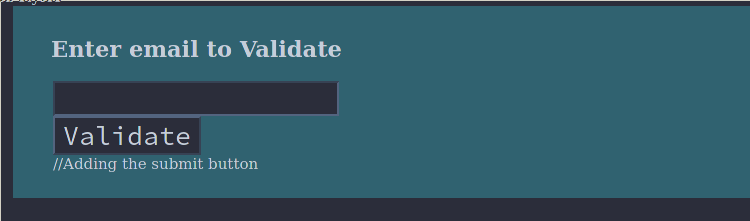

\newpage

# JavaScript Programs

## Program to print table using JavaScript

Here's the function to print the table using `js`

```javascript
function printDiv(divId) {
	// get the div html
	var divElements = document.getElementById(divId).innerHTML;
	// get the HTML of whole page
	var oldPage = document.body.innerHTML;
	// reset the page's HTML with div's HTML only
	document.body.innerHTML = "<html><head><title></title></head><body>" + divElements + "</body>";
	// print page
	window.print();
	// restore orignal HTML
	document.body.innerHTML = oldPage;
}
```

## Program to validate email id

Here's the function to validate email id with help of `js regex`

### Code

```javascript
function validateEmail(inputText) {
	let mailformat = /^w+([.-]?w+)*@w+([.-]?w+)*(.w{2,3})+$/;
	if (inputText.value.match(mailformat)) {
		alert("You have entered email in right way");
		document.form1.text1.focus();
		return true;
	}
	else {
		alert("You have not entered corret type of email");
		document.form1.text1.focus();
		return false;
	}
}```

Let's see the html and css to work with this function

**HTML**

```html
<!DOCTYPE html>
<html lang="en">
	<head>
		<meta charset="utf-8">
		<title>JavaScript email validation</title>
		<link rel='stylesheet' href='./emailvalidate.css' type='text/css' />
	</head>
	<body onload='document.form1.text1.focus()'>
		<div class="mail">
			<h2>Enter email to Validate</h2>
			<form name="form1" action="#">
				<ul>
					<li><input type='text' name='text1'/></li>
					<li> </li>
					<li class="Validate">
						<input type="submit" name="Validate"
						value="Validate" onclick="ValidateEmail(document.form1.text1)"/>
					</li>
					<li> </li>
				</ul>
			</form>
		</div>
		<script src="./emailvalidate.js"></script>
	</body>
</html>
```

**CSS**

```css
li {list-style-type: none;
	font-size: 16pt;
}
.mail {
	margin: auto;
	padding-top: 10px;
	padding-bottom: 10px;
	width: 800px;
	background : rgb(153, 198, 211);
	border: 1px soild rgb(1, 20, 24);
}
.mail h2 {
	margin-left: 38px;
}
input {
	font-size: 20pt;
}
input:focus, textarea:focus{
	background-color: lightyellow;
}
input submit {
	font-size: 10pt;
}
```

### Output

<div id="fig:validate email">


</div>

**Practical 4 Finished**


### Tools used in creating this practical(pdf)

* **OS                     :** 5.4.85-1-MANJARO
* **WM**                   : [DWM](https://dwm.suckless.org)
* **Pdf(markup) convertor**: Pandoc(2.11.2)
* **Pdf engine             :** xelatex
* **Source File Format     :** Markdown(md)
* **Text Editor            :** Neovim-nightly(v0.5.0-dev+1000-g84d08358b)
* **Java env used          :** java-11-openjdk
* **Browsers used          :** w3m, Librewolf

---
									*-*-* THE END *-*-*
---
